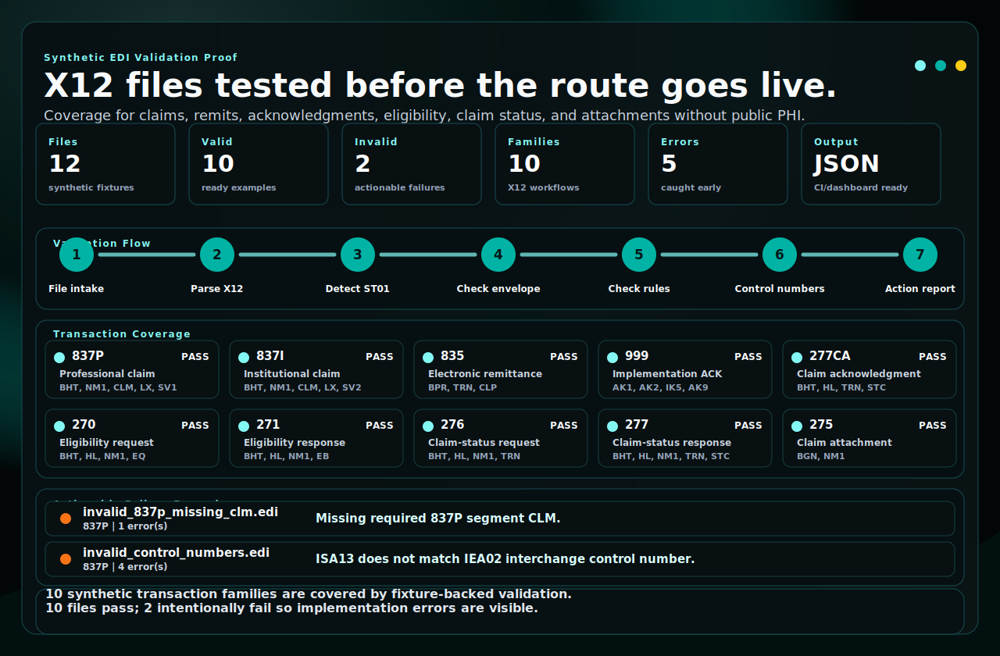

# RevCycleMGMT EDI Validation Harness

[](#quickstart)
[](#transaction-coverage)
[](#quickstart)
[](#public-safety-boundary)
[](#public-safety-boundary)

Synthetic, local-first validation harness for EDI/X12 revenue cycle transactions.

This repository is a public RevCycleMGMT proof asset. It shows how startup practices and small provider groups can test claim, eligibility, remittance, acknowledgment, claim-status, and attachment files before a production clearinghouse route is allowed to carry sensitive work.

No PHI. No production payer files. No clearinghouse credentials. No client data.



---

## Executive View

RevCycleMGMT does not treat X12 files like random text exports. This harness proves the operating discipline behind a revenue infrastructure engagement:

1. A synthetic EDI file lands in a controlled validation step.
2. The transaction type is detected from the X12 transaction header.
3. Required envelope, transaction, and control-number rules are checked.
4. The file receives a clear pass/fail result with actionable errors.
5. A folder-level summary shows what is ready, what failed, and which workflows need attention.

That is the implementation pattern a clinic needs before claims, eligibility, remits, attachments, and payer responses become part of an operating dashboard.

## Visual Proof Artifact

The README visual above is generated from the synthetic fixture folder. It is not a static screenshot. It shows the implementation checkpoint RevCycleMGMT would use before a route is trusted:

| Visual lane | What it proves |
| --- | --- |
| KPI cards | File count, pass/fail mix, transaction-family coverage, caught errors, and JSON output readiness. |
| Validation flow | File intake, parsing, ST01 detection, envelope checks, transaction rules, control numbers, and action reporting. |
| Transaction coverage | Ten synthetic X12 workflow families are fixture-backed and pass validation. |
| Failure examples | The repo intentionally includes missing-segment and control-number failures so buyers can see actionable reporting. |

Regenerate it locally:

```bash
python -m revcyclemgmt_edi_validation.proof_artifacts --fixtures tests/fixtures --out output_demo
cp output_demo/edi_validation_coverage.svg docs/assets/edi-validation-coverage.svg
```

## Tool Strip

| Layer | Tooling | What it proves |
| --- | --- | --- |
| Runtime | Python 3.11+ | Portable local validation without a hosted dependency. |
| Validation | RevCycleMGMT rule engine | Required segments, transaction detection, and control-number checks. |
| Test data | Synthetic X12 fixtures | Public proof without patient records, payer secrets, or production files. |
| Quality | pytest | Repeatable checks for valid and invalid revenue-cycle transaction examples. |
| Output | JSON reports | Results that can feed CI, dashboards, workqueues, or implementation notes. |

## Validation Flow


## Transaction Coverage

| Transaction | Revenue-cycle workflow | Required anchors checked | Fixture |
| --- | --- | --- | --- |
| 837P | Professional claim | `BHT`, `NM1`, `CLM`, `LX`, `SV1` | `valid_837p.edi` |
| 837I | Institutional claim | `BHT`, `NM1`, `CLM`, `LX`, `SV2` | `valid_837i.edi` |
| 835 | Electronic remittance | `BPR`, `TRN`, `CLP` | `valid_835.edi` |
| 999 | Implementation acknowledgment | `AK1`, `AK2`, `IK5`, `AK9` | `valid_999.edi` |
| 277CA | Claim acknowledgment | `BHT`, `HL`, `TRN`, `STC` | `valid_277ca.edi` |
| 270 | Eligibility request | `BHT`, `HL`, `NM1`, `EQ` | `valid_270.edi` |
| 271 | Eligibility response | `BHT`, `HL`, `NM1`, `EB` | `valid_271.edi` |
| 276 | Claim-status request | `BHT`, `HL`, `NM1`, `TRN` | `valid_276.edi` |
| 277 | Claim-status response | `BHT`, `HL`, `NM1`, `TRN`, `STC` | `valid_277.edi` |
| 275 | Claim attachment | `BGN`, `NM1` | `valid_275.edi` |

## What This Proves

For a buyer, this repo demonstrates that RevCycleMGMT can build the validation layer before a clearinghouse, payer-direct, or API-enabled route becomes operational.

- It identifies the transaction type from the file itself.
- It separates professional and institutional claim examples.
- It checks ISA/IEA, GS/GE, and ST/SE control-number consistency.
- It verifies required segment presence for ten synthetic transaction families.
- It reports invalid files in plain JSON that an implementation team can act on.
- It creates a foundation for companion-guide rule packs, payer route testing, and claims-to-payment dashboards.

## Quickstart

```bash
python -m venv .venv
source .venv/bin/activate
pip install -e . pytest
pytest -q
python -m revcyclemgmt_edi_validation validate tests/fixtures/valid_837p.edi
python -m revcyclemgmt_edi_validation.proof_artifacts --fixtures tests/fixtures --out output_demo
```

Windows PowerShell activation:

```powershell
python -m venv .venv
.venv\Scripts\Activate.ps1
pip install -e . pytest
pytest -q
python -m revcyclemgmt_edi_validation validate tests/fixtures/valid_837p.edi
```

## CLI Modes

Validate one file:

```bash
python -m revcyclemgmt_edi_validation validate tests/fixtures/valid_837p.edi
```

Validate a folder and print one report per file:

```bash
python -m revcyclemgmt_edi_validation validate-folder tests/fixtures
```

Validate a folder and print one executive summary:

```bash
python -m revcyclemgmt_edi_validation validate-folder tests/fixtures --summary
```

Example summary shape:

```json
{
  "valid": false,
  "file_count": 12,
  "valid_count": 10,
  "invalid_count": 2,
  "transaction_counts": {
    "270": 1,
    "271": 1,
    "275": 1,
    "276": 1,
    "277": 1,
    "277CA": 1,
    "835": 1,
    "837I": 1,
    "837P": 3,
    "999": 1
  }
}
```

## Example Single-File Output

```json
{
  "valid": true,
  "transaction_type": "837P",
  "errors": [],
  "warnings": [],
  "segment_count": 11
}
```

## Generated Artifacts

| Artifact | Purpose |
| --- | --- |
| `output_demo/edi_validation_report.json` | Buyer-readable validation proof model with summary metrics, transaction coverage, invalid files, and plain readout text. |
| `output_demo/edi_validation_coverage.svg` | Generated native SVG coverage and pass/fail proof artifact. |
| `docs/assets/edi-validation-coverage.svg` | README-facing copy of the generated SVG. |

## Clearinghouse And API Readiness

This repository does not claim a live clearinghouse integration, payer certification, or official vendor relationship. It demonstrates the validation layer that should exist before connecting to an API-enabled clearinghouse route.

Correct public wording:

> RevCycleMGMT builds validation and test harnesses for EDI/X12 transactions used in eligibility, claims, acknowledgments, claim status, remittance, payer routing, and attachment workflows.

## Repository Layout

```text
src/revcyclemgmt_edi_validation/
  cli.py              command-line interface
  parser.py           X12 segment parser
  proof_artifacts.py  generated JSON and SVG proof reports
  rules.py            transaction required-segment rules
  validator.py        validation engine
tests/
  fixtures/           synthetic X12 examples
  test_validator.py   parser, validation, and CLI summary tests
docs/
  assets/edi-validation-coverage.svg
  website-card-copy.md
  implementation-notes.md
  optum-api-positioning.md
output_demo/
  edi_validation_report.json
  edi_validation_coverage.svg
```

## Public Safety Boundary

This is a public synthetic demo. Do not place real claims, real patient records, payer credentials, clearinghouse credentials, private keys, production EDI files, client exports, or screenshots containing sensitive information in this repository.

See:

- `SECURITY.md`
- `COMPLIANCE.md`
- `docs/implementation-notes.md`

## Roadmap

- Companion-guide rule packs by payer or clearinghouse route.
- Loop-level validation for production-grade claim readiness.
- Rejected 999 and 277CA golden fixtures.
- JSON report schema for CI and dashboard ingestion.
- Contract tests shared with the RevCycleMGMT claims pipeline repository.

## License

MIT.
